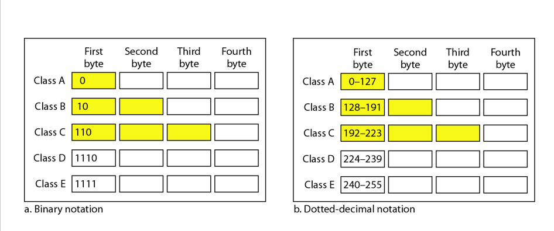
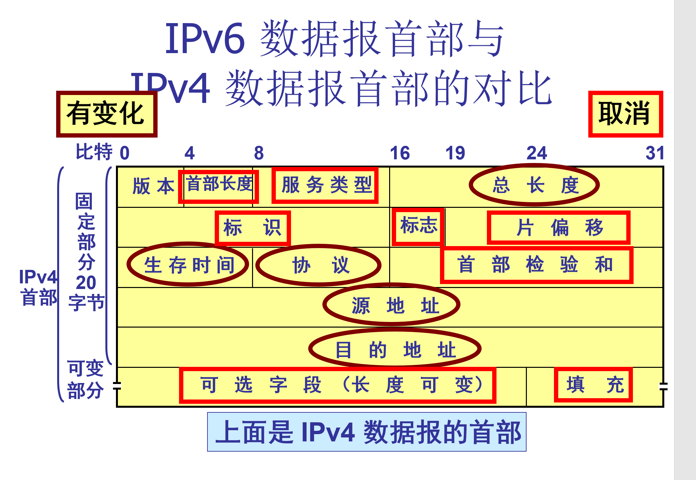
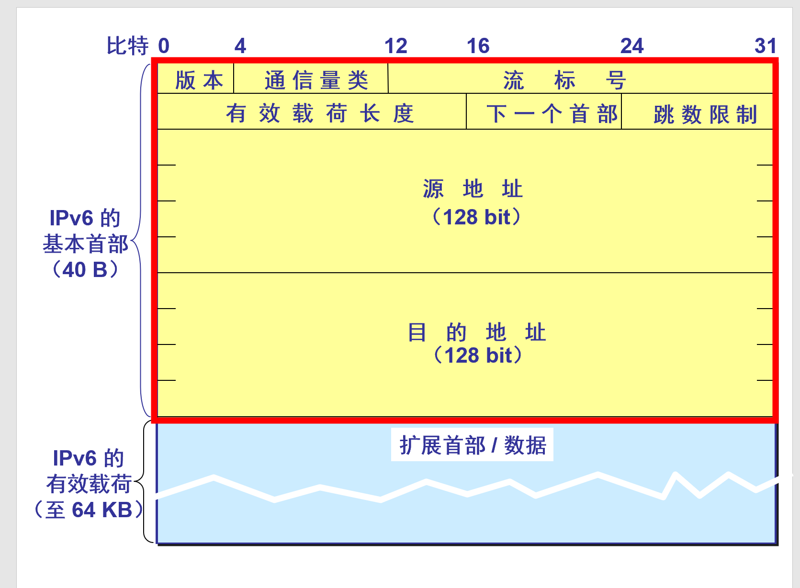
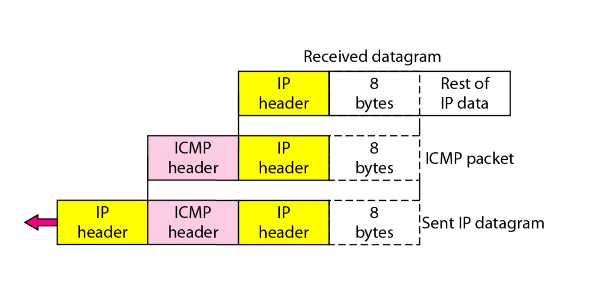

# Chapter 19 逻辑寻址

哈哈, 全加粗了.

## IPv4地址

常识性的东西就不说了.

### 地址分类

ABCDE五类地址

重点在ABC类上.

#### A类地址

A类地址网络号只有前8位, 其中第一位必须是0.

网络号全0表示本网络, 是预留的.

网络号后七位全1用于本地环回测试, 也是预留的.

**所以A类地址有 $$ 2^{7} - 2$$ 个网络**

主机号是后面24位.

主机号全0表示网络号指定的该网络, 预留.

主机号全1表示广播, 预留.

**所以A类地址一个网络最多有 $$ 2^{24} - 2$$ 个主机**

#### B类地址

网络号有前面16位, 其中前两位必须是10.

网络号128.0是不指派, 最少也得是128.1

**所以B类地址有 $$ 2^{14} - 1$$ 个网络**

类似的, **B类地址一个网络最多有 $$ 2^{16} - 2$$ 个主机**

#### C类地址

与B类地址类似:

**C类地址有 $$2^{21}-1$$ 个网络, 最多$$2^{8}-1$$ 个主机**

### 几类特殊的地址

#### 网络地址

就是主机号全为0, 只能用来标识网络, 不能分配给主机

#### 直接广播地址

网络号+全1的主机号, 只能用来当目的地址, 在这个网络上的所有设备都将接受处理.

#### 受限广播地址

就是255.255.255.255, 只能当目的地址. 

这个网络的所有设备都要收.

不是整个英特网, 路由器会屏蔽这个包.

是一个**E**类地址

#### 这个网络中的这个主机

就是0.0.0.0, 在主机第一次加入网络的时候问ip用.

是一个**A**类地址

#### 这个网络的特定主机

就是网络号全0+主机号

是一个**A**类地址

#### 环回地址

网络号是127, 主机号随意.

是一个**A**类地址

## NAT

NAT可以解决ip地址不够用的问题.

其实就是一个NAT服务器后面罩着一群小东西, 小东西用一个端口发的数据包到了NAT服务器就变成了NAT的另一个端口发的. 

然后NAT服务器会记录下来这个对应关系, 收到对应的数据包再按照NAT表发回去.

如果从外面收到NAT表里面没有的数据包, 那就把他给扔了.

## 子网划分

### 子网

网络号+主机号不合理, 借用主机号的几位区别子网.

划分子网纯属网络单位内部的事情, 在外面看他还是一个网络.

### 子网掩码

子网掩码标识网络地址.

子网掩码与IP地址按位与结果就是他的网络地址, 只有子网掩码按位与之后相等的两个IP地址, 才在一个子网里.

### 划分子网的方法

#### 直接按类

ABC类+子网划分, 不太好吧

#### CIDR

无分类编址.

就是没有ABC类之分, 一切都靠子网掩码.

IP地址化成两部分: **网络前缀; 主机号**

用斜线记法: ip地址/掩码1的长度

就是前多少位是前缀, 掩码长度就多少

##### 路由聚合/超网

就是几个前几位相同的地址块, 可以合在一起用一个CIDR地址块包含起来, 就是看最长公共前缀.

## IPv6地址

128位, 16字节, 32个数, 8段.

### 缩短

每段开头有连续的0, 可以省去, 但是一段至少有一位.

如果有连续的全0段, 可以用一个**::**表示.

但是一个地址里最多只能出现一个**::**

# Chapter 20 IP协议

## IP数据包的格式

一个一个说

1. 版本: 4bits, 说明IP数据报用的IPv4还是v6
2. 首部长度: 4bits, ipv4数据报首部最大60字节, 一般都是20字节, 这个0-15的数字*4就是字节数. **单位是4字节**
3. 服务类型: 8bits, 没人用过.
4. 总长度: 就是包括头部的, 整个IP数据报的长度, 最长65535B(具体多长限制于MTU) **单位是1字节**
5. 标识: 是一个计数器, 用来产生数据包的标识
6. 标志: 前两位是MF/DF, 第三位没人用, 分片用的.
7. 片漂移: 分片用的 **单位是8字节**
8. 生存时间(TTL): 到一个路由器就-1, 为0就给他扔了, 防止他转圈.
9. 协议: 标明这个数据报应该交给什么协议处理.
10. 首部校验和: 用一个更简单的方式, **只检查首部是否有错**.
11. 源地址
12. 目的地址

## 分段

### MTU

Maximum Transmission Unit, **链路层**的一个属性.

就是一个帧里面他能装的最大数据字节数, 不包括链路层的头.

也就是说一个IP数据报长度不能超过他的下层链路层的MTU.

以太网的MTU是1500

所以数据一大肯定是要分段的

### 标志位MF

More Frames: 指示后面是不是还有这一帧被分出来的续帧.

也就是一个长达14800B的数据被做成了ip数据报, 长度15020, MF=0;

但是中间遇到了以太网, 看门的路由器就会把他分成10段, 每段1480B, 加上头正好1500B.

这十个数据报里面, 前九个的MF都是1, 只有最后的MF=0;

## IPv6数据报格式

好, 除了版本都不一样.

拓展首部是算在载荷里的.

1. 版本: 4bits, 就是v4或者v6

2. 通信量类, 8bits, 是一种优先级. 优先级中有两类, 前8个优先级可以被拥塞控制, 后8个不能被拥塞控制.

3. 流标号, 20bits, 好像有一些神奇的用途, 视频和语音的传输之类的.

4. 有效载荷长度: 16bits, 拓展首部+数据的长度, 最长能表示64KB.

5. 下一个首部, 8bits, 协议字段或者类似链表指向下一个可选字段

6. 跳数限制, 8bits, 类似TTL

7. 源地址, 128bits.

8. 目的地址, 128bits.

   

## IPv4和IPv6混合

三种技术:

1. 双协议栈

2. 头部转换

3. 隧道

   

# Chapter 21 地址映射 差错报告 多播

## ARP

### 作用

一个主机在给另一个主机发IP数据报, 他知道对面的IP, 做好了IP数据报. 问题是链路层需要知道他的MAC地址. 

这就是ARP的作用, 用一个IP就能拿到对应的MAC地址.

### 方法

就是这个主机先**广播**一个ARP数据报, 说明自己想要谁的MAC地址.

然后这个主机收到之后, 就会**单播**一个ARP数据报, 告诉他自己的MAC地址.

如果要发送给的主机和自己不在一个子网, 发送方就先找路由器的MAC地址.

### 数据报格式

1. 硬件类型, 以太网都是1.
2. 协议类型, IP协议都是0800H
3. 硬件地址长度, MAC地址都是6
4. 协议(地址)长度, IPv4都是4
5. 操作类型, 请求是1, 回复是2

请求的时候, 目标MAC地址全0

### 封装

ARP是三层协议, 还是要经过链路层的封装.

封装的时候, 发送时目的MAC地址是广播地址, 全1.

## DHCP

好像不太考, 只要知道他分ip的就行了

## ICMP

ICMP报文有两种:

1. 差错报告报文
2. 询问报文

### 差错报告报文

1. 终点不可达: 路由器或者主机不能交付数据报.
2. 源站抑制: 拥塞而丢弃数据报.
3. 时间超过: TTL为0, 或者终点在规定时间内不能收到数据报的全部报片.
4. 参数问题: 数据报首部有不正确的值. (现在一般不发了)
5. 改变路由: 仅由路由器发送, 让主机知道下一次应该发给其他路由(更好的路由).

#### 不应发送差错报告报文的情况

1. 对ICMP差错报文不应再发一次.
2. 对不是第一个的分片数据报不发
3. 对具有组播地址的数据报不发
4. 特殊地址(127.0.0.0或者0.0.0.0)不发

### 询问报文

我感觉这个分类不重要

### 差错报文格式

ICMP虽然是网络层协议, 但是ICMP报文还是要当成IP数据报的内容, 前面加个IP头送给链路层.

ICMP的差错报文包括了ICMP头, 还有出错了的数据报的IP头, 和那个IP数据报的数据的前8字节(包括了传输层的端口号)

**所以ICMP封装好的报文实际上有两个IP头, 一个是他应该有的IP头, 还有出错了的IP头**

## IGMP

好像不太重要.

控制网络中加入离开之类的东西.

跟ICMP一样, 装在IP数据报里发出去.

IGMP的IP数据报的TTL一定为1.

# Chapter 22 传递,转发和路由选择

## 传递和转发和路由选择的区别

传递是指知道了从哪发向哪之后, 把数据传过去的物理过程.

转发是指路由器根据**转发表**在决定从哪发向哪的过程.

路由选择是根据路由选择算法得到**路由表**的过程, **转发表是从路由表得到的**.

在讨论路由选择的原理的时候, 不区分路由表和转发表, 都叫路由表.

路由表只给出下一跳的地址, 这样可以让路由表更灵活.

## 路由协议

自治系统: 就是比一个局域网更大的一个单位, 可以是一个机构的全部网络这样的, 这里面使用相同的路由选择协议.

路由协议分为两类:

1. 内部网关协议, 在一个自治系统内使用的协议
   1. RIP
   2. OSPF
2. 外部网关协议, 组织不同的自治系统的协议
   1. BGP

### RIP

使用**距离-向量算法**.

每个路由器每隔一段时间就把自己的路由表发给相邻的路由器.

一个路由器收到其他路由器的路由表后, 先把这个路由表的下一跳全部改成发给他路由表的这个路由器, 然后跳数全部+1.

然后把这个修改后的路由表跟自己的路由表比对, 发现改过的路由表有自己路由表没有的子网, 就把这一项加进去, 下一跳就走他. 

发现他记录的哪一个地方自己的路由表也有, 看看自己本来是不是走他的. 如果本来就走他, 那无论如何都要更新一下, 变成他的距离+1.

如果自己本来不是走他的, 就看一下走他是不是会更近, 是的话更新一下.

每一段时间所有路由器都要跟最近的路由器沟通一下路由表, 如果有个路由器半天不说话, 旁边的路由器就知道他死了, 把距离改成16(不可达).

如果有个网死了, 旁边最近的一个路由器会在发自己的路由表的时候告诉旁边的人这个网死了, 其他路由器都会更新自己的路由表知道这个网死了.

但是可能会出现这样的情况, 就是有个网死了, 这个路由器刚想告诉别人这个网死了, 结果旁边有个傻逼嘴快发路由表告诉他自己可以到这个网, 只需要4步. 但是这个路由器可不知道这四步第一步就是从他那走. 然后这个路由器就听信这个傻逼把自己的路由表也给改了. 过了一会这个路由器告诉这个傻逼自己也能到这个网了, 只需要先到你那, 这样只需要5步. 这个傻逼一看自己本来就是走他那的, 他现在到那个网需要5步了, 是不是路变远了, 就把自己的路由表改成了6步到这个网. 这样捯饬半天, 等他们俩都把自己路由表折腾到16的时候, 两个傻逼才知道这个网死了. 所以不能把无限大设的太大, 要不然这俩傻逼搞半天都搞不懂这网死了. 这个叫, **坏消息传得慢**.

RIP属于**应用层**的协议, 他的报文通过**UDP**发出去.

### OSPF

这个方法比较强一点, 不是一种分布式算法.

每个路由器定时戳一戳身边的路由器看看他还活着没. 如果发现旁边有个人死了或者莫名其妙突然多了个人, 就赶紧发个通告告诉旁边的人自己身边人变了. 旁边的路由器收到这个通告的时候改一下自己的**链路数据库**, 并且把这个通过告诉给自己身边的其他人. 这样, 每个人的**链路数据库**都保持到了最新的拓扑情况. 这个链路数据库记录了整个网络长啥样. 然后每个路由器就能用Dijkstra记录出来到每个地方最近的路线了, 按照这个路线发给下一个人就行.

链路数据库保存了每个路由器的位置, 还有每条线路的速度延迟之类的数据, 不再像RIP只使用跳来衡量了.

OSPF的报文直接作为IP数据报的数据, 加个IP头就送给链路层了, 不用UDP, 可以看成传输层的协议.

但是一个自治系统太大了, 路由器可能存不下这么大的链路数据库, 更新链路数据可也很占带宽. 所以OSPF又把一个自治系统分成了一堆区域, 然后一个主干部分把所有区域连起来.

### BGP

BGP属于外部网关协议, 是用于连接不同自治系统的协议. 

每个自治系统需要找一个路由器当发言人, 然后每个自治系统之间的发言人刚开始会把自己的BGP路由表全部发出去, 之后只有当自己的自治系统网络结构发生变化之后才发.

BGP的报文使用**TCP**发出去, 所以BGP属于应用层协议.

BGP使用的是路径-向量协议.

## 多(组)播

就是一个数据报用个组播地址, 到了一个路由器这个路由器就会把他复制几份发给不同的端口.

**组播地址使用D类地址**

组播地址需要换算成多播MAC地址, 但是D类地址中间有28位自由的, 但是换算成MAC地址只有23位与IP地址有关, 有5位信息丢失. 但是在一个网络中这样的冲突概率很小, 所以就不管了.

